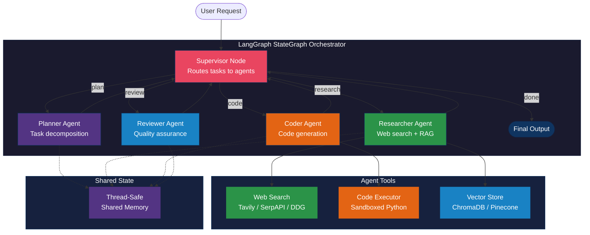

# LangChain Multi-Agent Framework

A production-ready Python framework for multi-agent orchestration using LangChain, LangGraph, and CrewAI patterns. Build teams of specialized agents that collaborate to solve complex tasks with shared memory, tool access, and supervisor-driven routing. Cross-cloud compatible with OpenAI, Anthropic, and Azure OpenAI.

## Architecture



## Prerequisites

| Requirement | Version | Notes |
|---|---|---|
| Python | >= 3.11 | Required for modern type hint syntax |
| pip | >= 23.0 | For dependency installation |
| OpenAI API key | - | Or Anthropic/Azure OpenAI key |
| ChromaDB | >= 0.5.0 | Default vector store; Pinecone/Weaviate optional |

## Installation

```bash
# Clone the repository
git clone https://github.com/your-org/langchain-multi-agent-framework.git
cd langchain-multi-agent-framework

# Create and activate a virtual environment
python -m venv .venv
source .venv/bin/activate  # On Windows: .venv\Scripts\activate

# Install dependencies
pip install -e ".[search,dev]"

# Configure environment variables
cp .env.example .env
# Edit .env with your API keys
```

## Configuration

### Environment Variables

| Variable | Required | Default | Description |
|---|---|---|---|
| `OPENAI_API_KEY` | Yes* | - | OpenAI API key (*or use another provider) |
| `ANTHROPIC_API_KEY` | No | - | Anthropic API key (alternative provider) |
| `AZURE_OPENAI_API_KEY` | No | - | Azure OpenAI API key (alternative provider) |
| `LLM_PROVIDER` | No | `openai` | LLM provider: `openai`, `anthropic`, `azure_openai` |
| `LLM_MODEL` | No | `gpt-4o` | Model identifier |
| `LLM_TEMPERATURE` | No | `0.0` | Sampling temperature |
| `LLM_MAX_TOKENS` | No | `4096` | Maximum output tokens |
| `TAVILY_API_KEY` | No | - | Tavily search API key (preferred search) |
| `SERPAPI_API_KEY` | No | - | SerpAPI key (fallback search) |

### OrchestratorConfig Options

| Parameter | Type | Default | Description |
|---|---|---|---|
| `llm` | `LLMConfig` | OpenAI GPT-4o | LLM provider configuration |
| `vector_store` | `VectorStoreConfig` | ChromaDB local | Vector store backend settings |
| `max_concurrent_agents` | `int` | `3` | Maximum parallel agent executions |
| `default_timeout_seconds` | `int` | `300` | Agent execution timeout |
| `enable_shared_memory` | `bool` | `True` | Enable shared memory between agents |
| `recursion_limit` | `int` | `50` | Maximum graph iterations |

## Usage Example

```python
from src.config import LLMConfig, LLMProvider, OrchestratorConfig
from src.orchestrator import MultiAgentOrchestrator

# Configure the orchestrator
config = OrchestratorConfig(
    llm=LLMConfig(
        provider=LLMProvider.OPENAI,
        model="gpt-4o",
        temperature=0.0,
    ),
    recursion_limit=25,
)

# Create and run
orchestrator = MultiAgentOrchestrator(config)
result = orchestrator.run(
    "Research best practices for building REST APIs, then write a "
    "FastAPI implementation with user CRUD operations and JWT auth."
)
print(result)
```

### Running Examples

```bash
# Research team example
python -m examples.research_team

# Development team example
python -m examples.dev_team

# Customer support with knowledge base
python -m examples.customer_support
```

## Step-by-Step Implementation Guide

1. **Install dependencies** -- Follow the installation section above to set up the Python environment and install all required packages.

2. **Configure LLM provider** -- Set the appropriate API key environment variable for your chosen provider (OpenAI, Anthropic, or Azure OpenAI). Create an `OrchestratorConfig` or use `OrchestratorConfig.from_env()`.

3. **Initialize the orchestrator** -- Create a `MultiAgentOrchestrator` instance with your config. This initializes all four specialized agents and builds the LangGraph StateGraph.

4. **Customize agents (optional)** -- Override default system prompts via `AgentConfig.system_prompt`. Add tools to specific agents by assigning to `agent.tools` and calling `agent.llm.bind_tools()`.

5. **Populate the knowledge base (optional)** -- If using RAG, create a `VectorStoreTool` and call `add_documents()` to ingest your reference materials before running queries.

6. **Run tasks** -- Call `orchestrator.run("your task description")` for synchronous execution or `await orchestrator.arun("your task")` for async. The supervisor routes work through the agent graph automatically.

7. **Monitor execution** -- Enable verbose mode in agent configs. Inspect `SharedMemory` entries for inter-agent communication logs. Check the `results` dict in the final state for per-agent outputs.

## Documentation Links

- [LangChain Introduction](https://python.langchain.com/docs/get_started/introduction) -- Core framework documentation for chains, prompts, and LLM integrations.
- [LangGraph Documentation](https://langchain-ai.github.io/langgraph/) -- StateGraph API reference for building agent workflows with conditional routing.
- [CrewAI Documentation](https://docs.crewai.com/) -- Reference for crew-based multi-agent patterns and role definitions.
- [LangChain Agents](https://python.langchain.com/docs/modules/agents/) -- Agent types, tool integration, and execution strategies.

## Project Structure

```
langchain-multi-agent-framework/
├── src/
│   ├── __init__.py
│   ├── orchestrator.py        # LangGraph StateGraph orchestrator with supervisor routing
│   ├── config.py              # Dataclass-based configuration management
│   ├── agents/
│   │   ├── base_agent.py      # Abstract base agent with LLM factory
│   │   ├── researcher.py      # Web search and RAG research agent
│   │   ├── coder.py           # Code generation agent
│   │   ├── reviewer.py        # Code review and QA agent
│   │   └── planner.py         # Task decomposition agent
│   ├── tools/
│   │   ├── web_search.py      # Multi-provider web search tool
│   │   ├── code_executor.py   # Sandboxed Python execution
│   │   └── vector_store.py    # Vector store for RAG retrieval
│   └── memory/
│       └── conversation.py    # Thread-safe shared memory
├── examples/
│   ├── research_team.py       # Research workflow example
│   ├── dev_team.py            # Development team example
│   └── customer_support.py    # Support with knowledge base
├── requirements.txt
├── pyproject.toml
├── LICENSE
└── CHANGELOG.md
```

## License

This project is licensed under the MIT License. See [LICENSE](LICENSE) for details.
